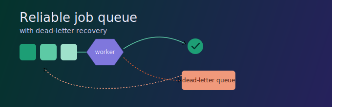
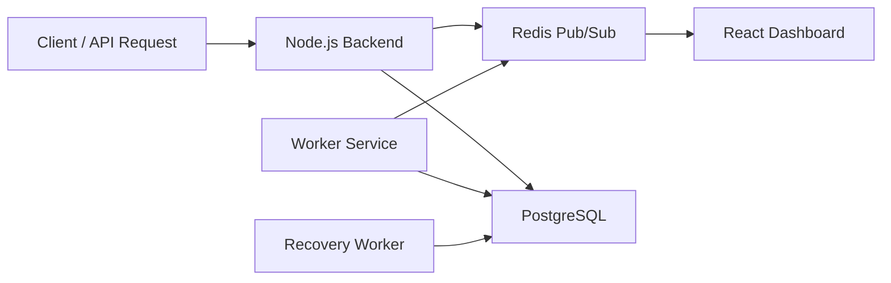

Reliable Distributed Job Queue Engine

  

A production-inspired distributed job queue built with **Node.js, PostgreSQL, Redis, React, WebSockets, and Docker**. The system ensures reliable background job execution through lease-based processing, automatic recovery, retries with exponential backoff, dead-letter queues, worker heartbeats, and real-time monitoring.

  Project Overview

Reliable Distributed Job Queue Engine is a fault-tolerant background job processing system inspired by production queue architectures.

Jobs are stored durably in PostgreSQL, claimed using a lease mechanism, processed by distributed workers, and automatically recovered if a worker crashes. Failed jobs are retried using exponential backoff before being moved to a Dead Letter Queue (DLQ). The system also includes worker heartbeats, Redis Pub/Sub, WebSocket-based live updates, Docker support, and a React monitoring dashboard.

 Features

- Durable PostgreSQL-backed job queue
- Lease-based distributed job processing
- Automatic lease recovery
- Retry mechanism with exponential backoff
- Dead Letter Queue (DLQ)
- Replay failed jobs
- Worker registration & heartbeat monitoring
- Automatic offline worker detection
- Redis Pub/Sub event broadcasting
- WebSocket-powered live dashboard
- Health check endpoint
- Dockerized multi-service setup

   System Architecture

